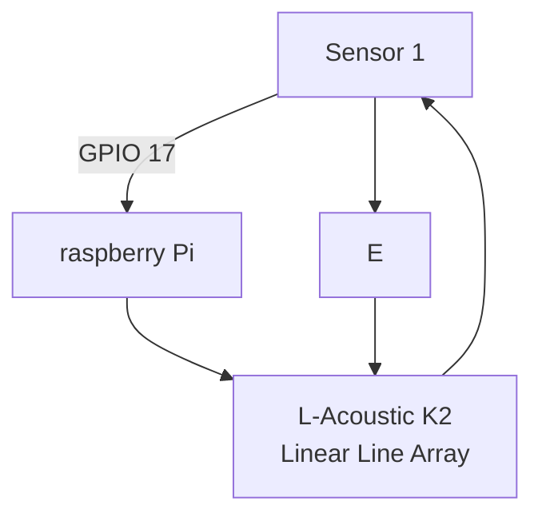
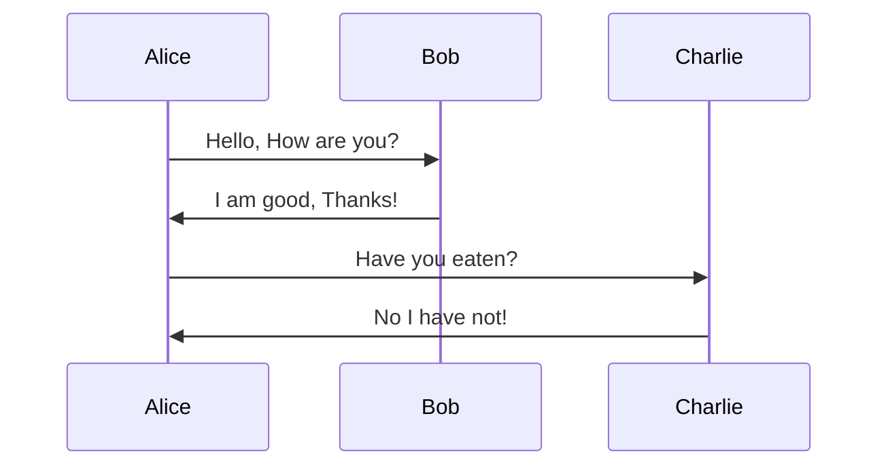

# Headers
This is for **heading 1.**

## Heading 2
This is for *heading 2.*


### Heading 3
This is for ***heading 3***

# List

This is how you list item in markdown.

1. Member 1
    * Team Leader
        * Project Owner
2. Member 2
    * Hardware
3. Member 3
    * Software
3. Member 4
    * Cheerleader

# Inserting an image

To insert an image, you will need to drag + hold shift +  drop


[click here to link](https://www.google.com)

[click here to jump to test.md](/test/test.md)

# Code Black

To highlight or insert a particular section of code, you can do the following

1. In raspberry pi, if you want to update you will `sudo apt update`

```
from tkinter import *

main = Tk()

main.mainloop()
```

# Quotes

A famous quote by **Sir Issac Newton**
> for every action, there will be a reaction.

# Tables

This is how you insert tables.

|Header A|Header B|Header C|
|--------|--------:|:---------|
|Row 1|Data A|Data B|
|Row 2|            Data C| Data D|


```
|-----:|This is to justify right
``` 

# Horizontal Rule

This is how to insert a section line

---


# Flowchart



# Sequence Diagram





